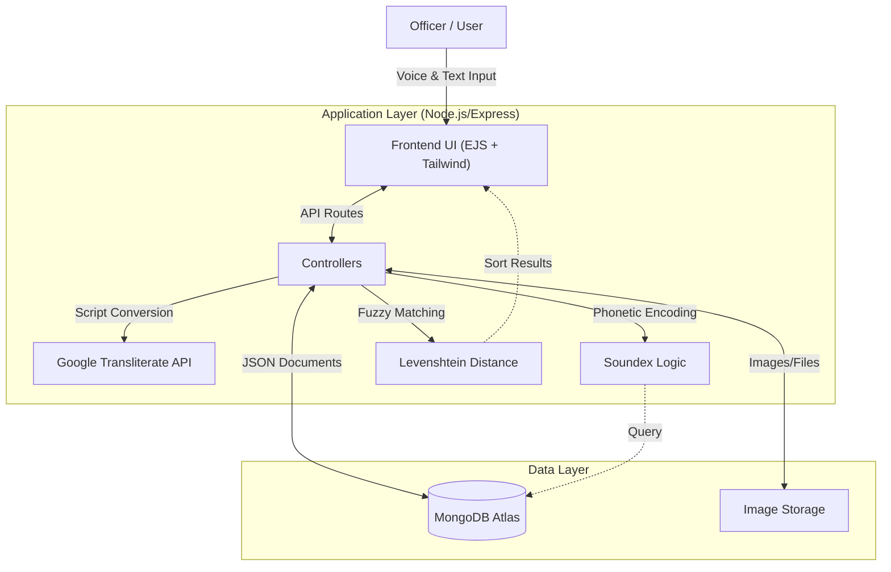

# FuzzRecords - Advanced Police Record Management System 🏆
> **SIH 2024 Runner Up Project** | Solving Problem Statement ID: 1787 (MP Police)

**FuzzRecords** is an advanced AI-driven platform capable of **phonetic matching** and **cross-script search** (Hindi/English) for criminal records. It eliminates data entry errors and ensures that names like "Suresh" and "Sursh" or "Kumar" and "Kumaar" are identified as the same individual.

---

## 🚩 The Problem
Police departments face critical challenges in maintaining and searching manual records:
1.  **Inconsistent Transliteration**: "Suresh" vs "Sursh".
2.  **Phonetic Similarity**: "Kumar" vs "Kumaar" are treated as different people.
3.  **Data Entry Errors**: Typos during manual entry lead to lost records.
4.  **Language Barrier**: Searching for a Hindi name using English queries (and vice-versa) is difficult.

---

## 💡 The Solution
We built a **Phonetic Intelligence Engine** that solves these issues:

### 1. Unified Search (Fuzzy Matching)
*   **Soundex Algorithm**: Converts names into phonetic codes (e.g., K560 for Kumar/Kumaar).
*   **Levenshtein Distance**: Calculates a "Match Percentage" based on spelling similarity.
*   **Result**: The system finds the right person even if the spelling is different.

### 2. Zero-Error Data Entry
*   **Voice-to-Text**: Officers can speak names to start searching or creating profiles, reducing typing bias.
*   **Real-time Transliteration**: Typing in English automatically generates accurate Hindi text.
*   **Preview Mode**: A mandatory "Pre-flight Check" page forces Verification before submission.

---

## 🔄 Process Flow
1.  **Data Entry**:
    *   Officer speaks or types a name (e.g., "Rohan").
    *   System auto-generates Hindi (`रोहन`).
    *   System uploads images/documents to secure storage.
2.  **Verification**:
    *   Officer reviews data in **Preview Mode**.
    *   Confirms & Submits -> Data stored in MongoDB Atlas.
3.  **Search & Retrieval**:
    *   Officer searches "Rohan" (English) or "रोहन" (Hindi).
    *   Backend converts query to phonetic code.
    *   Database returns all matching profiles (e.g., "Rohan", "Rowhan") sorted by relevance using our **Weighted Scoring Algorithm**.

---

## 🏗️ Technical Architecture



*   **Frontend**: EJS (Server-Side Rendering) + Tailwind CSS for a fast, government-grade UI.
*   **Backend**: Node.js & Express.js for scalable API handling.
*   **Database**: **MongoDB Atlas (NoSQL)** for storing unstructured data (nested addresses, multiple aliases).
*   **AI/ML Layer**:
    *   `natural` library for Phonetic Algorithms.
    *   `Google Transliterate API` for script conversion.
    *   `Web Speech API` for Voice Recognition.

---

## 🛠️ Tech Stack
| Component | Technology |
| :--- | :--- |
| **Frontend** | HTML5, EJS, Tailwind CSS, Vanilla JS |
| **Backend** | Node.js, Express.js |
| **Database** | MongoDB Atlas (Cloud) |
| **Algorithms** | Soundex, Levenshtein Distance, Metaphone |
| **Hosting** | Vercel / Render |

---

## 🚀 Impact
*   **90% Reduction** in data entry errors via Voice & Transliteration.
*   **Cross-Script Search** enables seamless operations between Hindi/English speaking officers.
*   **Faster Investigations**: finding suspects takes seconds, not hours of manual file checking.

---

### 👨‍💻 How to Run Locally
1.  Clone the repository.
2.  Install dependencies: `npm install`
3.  Set up environment variables (`MONGO_URL`, `CLOUDINARY_CLOUD_NAME`, etc.).
4.  Run the server:
    ```bash
    npx nodemon app.js
    ```
5.  Open `http://localhost:3000`
